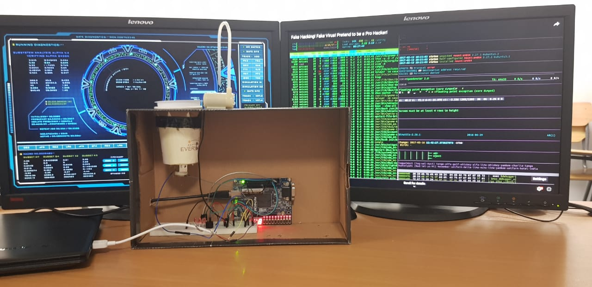

<h1> Washing Machine</h1>
The machine processes in 4 stages:

 1. Load the machine 
 2. water pumps in (not shown in video uploaded)
 3. tub spins
 4. air dry activation : (motor pumps air instead of water )

<h4>Technology used</h4>

 - Intel Quartus &
 - Prime Verilog

> 

> 
> <video width="400" controls> <source src="preview.mp4"
> type="video/mp4">   Downoad preview.mp4 to
> see the washing machine in action </video>

